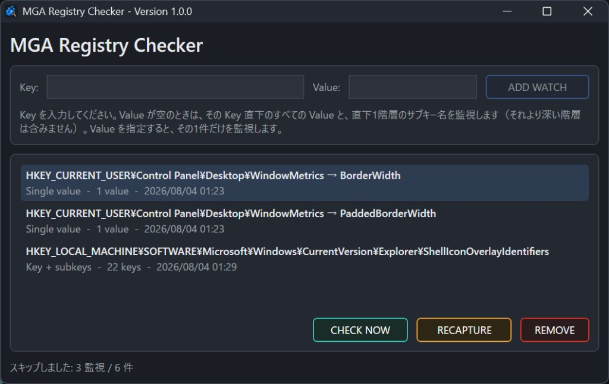
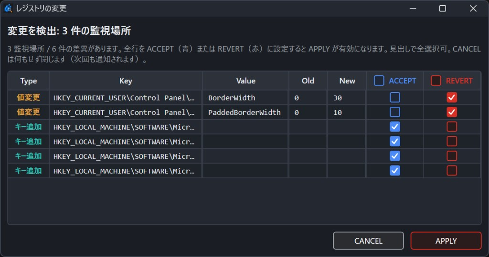

# MGA Registry Checker

レジストリの「いま」を覚えておき、あとで変わっていたらお知らせする Windows 用アプリです。  
常駐しません。起動して確認したら終了する使い方を想定しています。

プログラミングの知識は不要です。下の「使い方」から始めてください。

## 画面イメージ

メイン画面（監視の登録・一覧）:



差分画面（複数監視の変更をまとめて確認）:



## できること

- 気になるレジストリの場所を登録して、そのときの状態を保存する
- 起動時やボタン操作で、保存した状態と今の状態を比べる
- 違いがあれば一覧を表示し、「受け入れる」か「元に戻す」かを選べる

## 使い方

### 1. アプリを用意する

1. [Releases](https://github.com/mga-ueda/MGA-Registry-Checker/releases) から最新の `MGA-Registry-Checker-win-x64.zip` をダウンロードする  
2. 解凍すると正式名称の `MGA Registry Checker.exe` が出てくるので、好きなフォルダに置いてダブルクリックで起動する  

Windows だけ必要です。別途 .NET を入れる必要はありません（リリース版はランタイム同梱です）。

### 2. 監視したい場所を登録する

1. **Key** にレジストリのキーを入力する  
   例: `HKEY_CURRENT_USER\Control Panel\Desktop\WindowMetrics`
2. **Value** は次のどちらか  
   - **空欄** … そのキー直下のすべての値と、ひとつ下のサブキー名を監視（深い階層は見ません）  
   - **値の名前を入力** … その 1 件だけを監視  
     例: `BorderWidth`
3. 入力が正しければ「OK」と出るので、**ADD WATCH** を押す  

登録した瞬間のレジストリ状態がスナップショットとして保存されます。

### 3. 差分を確認する

- アプリを起動すると、登録済みの場所を自動でチェックします  
- 起動時に GitHub 上の新しいバージョンがあればお知らせし、ダウンロードページを開くか選べます（通常起動・スタートアップ時の裏起動どちらでも）  
- 一覧から行を選んで **CHECK NOW** でも、その場所だけ再チェックできます  
- 違いがなければ何も起きません。違いがあれば差分画面が **1 回**出ます（複数の監視で違いがあってもまとめて表示）  

### 4. 差分画面での選択

| 選択 | 意味 |
|------|------|
| **ACCEPT** | 今の状態を「正しい」ものとして覚える（レジストリは変えません） |
| **REVERT** | 以前覚えた状態にレジストリを戻す |
| **CANCEL** | 今回は何もしない（次回起動でもまた同じ差分が出ます） |

すべての行に ACCEPT か REVERT を付けてから **APPLY** で確定します。  
行ごとに混ぜて選ぶこともできます。

**便利な操作（知らないと気づきにくい）**

- 見出しのチェックで、ACCEPT / REVERT をまとめて ON/OFF できます  
- **チェックを押しながらドラッグ**すると、隣の行へ連続して同じ ON/OFF を広げられます  

### 5. Windows 起動時に自動チェックする（任意）

メイン画面左下の **「スタートアップで差分チェック」** にチェックを入れると、Windows にログオンしたときにアプリが裏で起動します。

- メイン画面は出ません（`--check` と同じ動き）  
- 新しいバージョンがあれば、差分チェックの前にお知らせダイアログが出ます  
- 差分がなければ（バージョン通知のあとは）何も表示せず終了します  
- 差分があれば取捨選択ダイアログだけ出ます  
- チェックを外すと、スタートアップ登録は削除されます  

ショートカットは作りません。レジストリ（`HKCU\...\Run`）に、**チェックした時点の EXE の場所**を絶対パスで覚えます。  
そのため **EXE を別フォルダへ移したり、名前を変えたりすると起動できなくなります。** そのときはチェックをいったん外してから、新しい場所の EXE でもう一度入れてください。

### 6. 終了する

**Esc** キー、またはウィンドウを閉じると終了します（バックグラウンドには残りません）。

## 画面の主な操作

| 操作 | 説明 |
|------|------|
| **ADD WATCH** | 入力した Key / Value を監視に追加する |
| **CHECK NOW** | 選択中の監視だけ、今すぐ比較する |
| **RECAPTURE** | 選択中の監視の「覚えている状態」を、今のレジストリで上書きする |
| **REMOVE**（または Del キー） | 監視をやめる（レジストリ自体は消しません） |
| **スタートアップで差分チェック** | ON でログオン時に `--check` 起動、OFF で登録削除（EXE 移動後は再登録が必要） |
| 一覧の余白をクリック | 選択を解除する |

## データの保存場所

監視一覧とスナップショットは次のファイルに保存されます。

`%LocalAppData%\MGA\MGA Registry Checker\state.json`

エクスプローラーのアドレスバーに `%LocalAppData%\MGA\MGA Registry Checker` と貼ると開けます。

## 注意

### ダウンロード直後にほかのアプリから起動できないとき

GitHub から落とした EXE には、Windows が「インターネットから来たファイル」という印（Mark of the Web）を付けることがあります。  
エクスプローラーから手動で開く分には動いても、**別アプリ（例: ランチャー）から起動すると**「この操作はユーザーによって取り消されました」などで失敗することがあります。

**プロパティに「許可する」が出る場合**（ローカルの NTFS など）:

1. EXE を右クリック → **プロパティ** → **全般** タブ  
2. 下部の「セキュリティ: 許可する」にチェック → OK  
（※ これは「セキュリティ」という別タブではありません。出ない環境もあります）

**「許可する」が無い場合**（Google Drive 上の `V:\マイドライブ\...` など、よくあります）:

PowerShell で次を実行します（パスは置いた場所に合わせてください）。

```powershell
Unblock-File -LiteralPath "V:\マイドライブ\MGA Registry Checker.exe"
```

または、EXE を **ローカルディスク**（例: `C:\Tools\...`）へコピーしてから使うと、印の影響を受けにくくなります。

一度印が外れれば、以後はほかのアプリからの起動も通るようになります。

### 管理者として起動するか

**普段は不要です。** `HKEY_CURRENT_USER` の監視や、スタートアップ登録だけなら管理者権限は要りません。

`HKEY_LOCAL_MACHINE` など、書き込みに管理者権限が必要な場所を **REVERT（元に戻す）** するときだけ、アプリを管理者として実行してください。常に管理者にしておく必要はありません。

### そのほか

- アプリは二重起動しません。既に起動中にもう一度開くと、既存のメイン画面を前面に出します（`--check` 起動中でメインが無い場合は、追加の起動は行われません）  
- Windows の表示スケール（DPI）がモニター間で変わっても、レイアウト比率は維持されます（PerMonitorV2）  

## ライセンス

[MIT License](LICENSE) © 2026 MIYABI GAME AUDIO INC.
